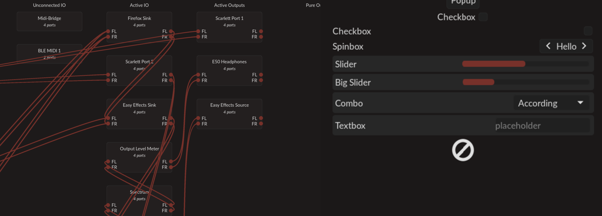

## hyprtoolkit
A modern C++ Wayland-native GUI toolkit

## What Hyprtoolkit is

Hyprtoolkit is designed to be a small, simple, and modern C++ toolkit for making wayland GUI apps, with
a few goals:

- Simple C++ API for making a GUI app
- Smooth animations
- Easy usage
- Simple system theming

### What Hyprtoolkit is not

Hyprtoolkit is not:
- cross-platform
- packed with crazy features
